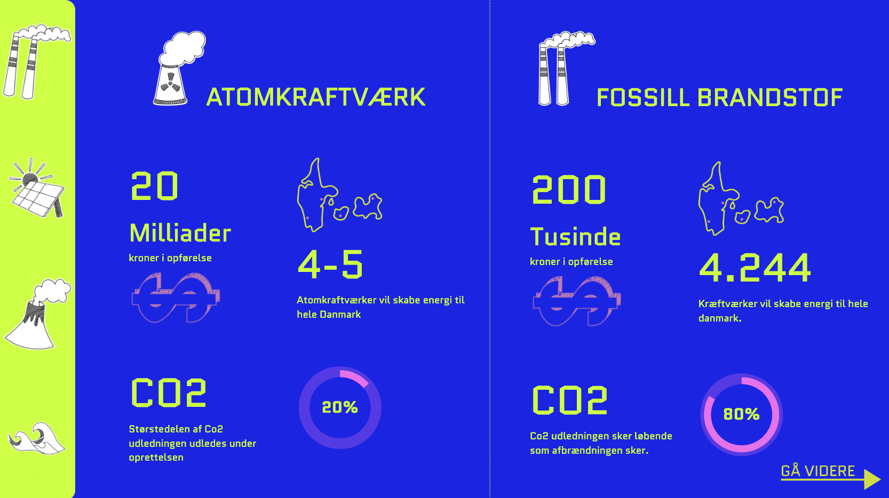

# Steno---Gruppe-2

## Hvordan vi har arbejdet med json




### Her har vi først hentet alle de steder i vores HTML hvor vi gerne vil have der sker en ændring

```Javascript
const energySourceElm = document.getElementById("energySource");
const prisElm = document.getElementById("pris");
const prisEnhedElm = document.getElementById("prisenhed");
const energiBilledeElm = document.querySelector(".sticker-energikilde");
const kortElm = document.querySelector("#kort");
const energyElm = document.getElementById("energy");
const energyTextElm = document.getElementById("energyText");
const Co2TextElm = document.getElementById("Co2Text");
const procentElm = document.getElementById("procent");
const fillElement = document.querySelector(".fill");
```

## Statisk - Uden json
### Først lavede vi det manuelt hvor vi lavede vi click ever med function til hvert af de energikilder der ligger i vores slider. Det vil sige vi manuelt skulle ind og skive alle de ting der skulle ændres ind til hver eneste click event. Vi fandt så ud af vi kunne bruge json til at gøre det mere dynamisk, nemmere at rettig i i fremtiden og undgå at skulle skrive de samme ting flere gange.

```Javascript
// Vindmølle
const vindmellerElm = document.getElementById("vindmeller");

vindmellerElm.addEventListener("click", function() {
    energySourceElm.innerText = "VINDMØLLER";
    prisElm.innerText = "800";
    prisEnhedElm.innerText = "Tusinde";
    energiBilledeElm.setAttribute("src", "img/vindmoeller.png");
    kortElm.setAttribute("src", "img/kort/vindmøllekort.png");
    energyElm.innerText = "3.800";
    energyTextElm.innerText = "Vindmøller vil skabe energi til hele danmark.";
    Co2TextElm.innerText = "Størstedelen af Co2 udledningen udledes under oprettelsen.";
    procentElm.innerText = "10%";
});

// Kraftværk
const krafvarkElm = document.getElementById("krafvark");

krafvarkElm.addEventListener("click", function() {
    energySourceElm.innerText = "FOSSIL BRANDSTOF";
    prisElm.innerText = "200";
    prisEnhedElm.innerText = "Tusinde";
    energiBilledeElm.setAttribute("src", "img/kraftveark.png");
    kortElm.setAttribute("src", "img/kort/kraftvearkkort.png");
    energyElm.innerText = "4.244";
    energyTextElm.innerText = "Kræftværker vil skabe energi til hele danmark.";
    Co2TextElm.innerText = "Co2 udledningen sker løbende som afbrændningen sker.";
    procentElm.innerText = "80%";
    fillElement.style.transform = "rotate(100deg)";
});
```
## Dynamisk - med json
### Ved først at hente alle vores energikilder fra slideren også lave click event til hver med funktionen fetchAndDisplay(index) kunne vi definere hvor i json-filen dataen skal hentes fra.

```json
[
    {
        "energikilde_billede": "kraftveark.png",
        "energikilde": "FOSSILT BRANDSTOF",
        "pris": "200",
        "pris_enhed": "Tusinde",
        "danmark_kort": "kraftvearkkort.png",
        "antal": "4.244",
        "antal_text": "Kraftværker vil skabe energi til hele danmark.",
        "co2_text": "Co2 udledningen sker løbende som afbrændningen sker.",
        "procent": "80%",
        "rotation": "150deg"
    },
    {
        "energikilde_billede": "solceller.png",
        "energikilde": "SOLCELLER",
        "pris": "800",
        "pris_enhed": "Tusinde",
        "danmark_kort": "kraftvearkkort.png",
        "antal": "3.800",
        "antal_text": "Vindmøller vil skabe energi til hele danmark.",
        "co2_text": "Størstedelen af Co2 udledningen udledes under oprettelsen.",
        "procent": "10%",
        "rotation": "20deg"
    },

    {
        "energikilde_billede": "vulkan.png",
        "energikilde": "TERMISK",
        "pris": "200",
        "pris_enhed": "Tusinde",
        "danmark_kort": "kraftvearkkort.png",
        "antal": "4.244",
        "antal_text": "Kræftværker vil skabe energi til hele danmark.",
        "co2_text": "Co2 udledningen sker løbende som afbrændningen sker.",
        "procent": "17%",
        "rotation": "50deg"
    },
    {
        "energikilde_billede": "boelger.png",
        "energikilde": "VANDKRAFT",
        "pris": "200",
        "pris_enhed": "Tusinde",
        "danmark_kort": "kraftvearkkort.png",
        "antal": "4.244",
        "antal_text": "Kræftværker vil skabe energi til hele danmark.",
        "co2_text": "Co2 udledningen sker løbende som afbrændningen sker.",
        "procent": "15%",
        "rotation": "20deg"
    },
    {
        "energikilde_billede": "vindmoeller.png",
        "energikilde": "VINDMØLLER",
        "pris": "800",
        "pris_enhed": "Tusinde",
        "danmark_kort": "vindmøllekort.png",
        "antal": "3.800",
        "antal_text": "Vindmøller vil skabe energi til hele danmark.",
        "co2_text": "Størstedelen af Co2 udledningen udledes under oprettelsen.",
        "procent": "10%",
        "rotation": "1deg"
    }
]
```

```Javascript
const krafvarkElm = document.getElementById("krafvark");
const salcelleElm = document.getElementById("salcelle");
const valkanElm = document.getElementById("valkan");
const balgerElm = document.getElementById("balger");
const vindmellerElm = document.getElementById("vindmeller");

krafvarkElm.addEventListener("click", () => {
    fetchAndDisplay(0); // Updated this line
});

salcelleElm.addEventListener("click", () => {
    fetchAndDisplay(1); // Updated this line
});

valkanElm.addEventListener("click", () => {
    fetchAndDisplay(2); // Updated this line
});

balgerElm.addEventListener("click", () => {
    fetchAndDisplay(3); // Updated this line
});

vindmellerElm.addEventListener("click", () => {
    fetchAndDisplay(4); // Updated this line
});

function fetchAndDisplay(index) {
    const url = "../json/data.json";
    fetch(url)
        .then(res => res.json())
        .then(json => {
            const val = json[index];
            energySourceElm.innerText = `${val.energikilde}`;
            prisElm.innerText = `${val.pris}`;
            prisEnhedElm.innerText = `${val.pris_enhed}`;
            energiBilledeElm.setAttribute("src", `img/${val.energikilde_billede}`);
            kortElm.setAttribute("src", `img/kort/${val.danmark_kort}`);
            energyElm.innerText = `${val.antal}`;
            energyTextElm.innerText = `${val.antal_text}`;
            Co2TextElm.innerText = `${val.co2_text}`;
            procentElm.innerText = `${val.procent}`;
        })
        .catch(error => {
            console.error('Error fetching JSON:', error);
        });
}
```
